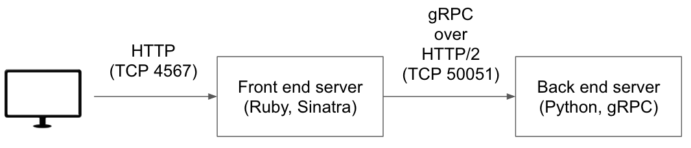

# grpc-demo-python-ruby

This is a sample service composed of microservices using [gRPC](http://www.grpc.io/).

* Front end server
  * Sinatra (Ruby)
* Back end server
  * gRPC (Python)



## How to try

```sh
$ git clone https://github.com/hosopy/grpc-demo-python-ruby.git
$ cd grpc-demo-python-ruby
$ docker-compose up
```

Try to open `http://0.0.0.0:4567/`.